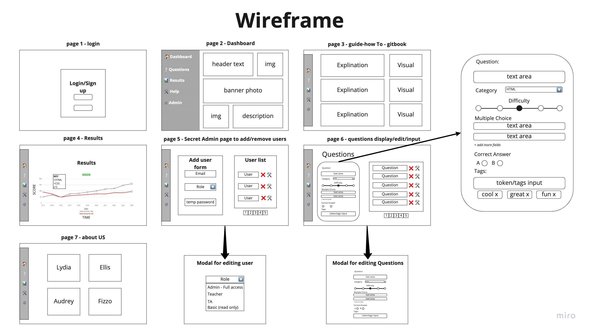

# Slack Bot Front End

### [Deployed Site](https://cf-slackbot.netlify.app/)

## Authors
🤖 [Audrey Patterson](https://github.com/arpatterson31)

🤖 [Ellis Yoo](https://github.com/yjyoo773)

🤖 [Fizzo Pannosch](https://github.com/fizzo999)

🤖 [Lydia Minehan-Tubic](https://github.com/LydiaMT)

## About The Application

A front end admin dashboard for our slack application [CF Slack Bot](https://github.com/CF-Slackbot/slackbot). A resource to see how students are performing on their CF Slack Bot quizzes. Administrators can create user accounts. All users with an active account have the ability to modify the question set for the Slack Bot via the [API server](https://github.com/CF-Slackbot/slackbot-questions-api). Add new questions, retire old outdated questions, or make edits to questions as technologies change. 

## Initial Wireframe

## Dependencies

- @auth0/auth0-react
- axios
- bootstrap
- chart.js
- dotenv
- react
- react-awesome-spinners
- react-bootstrap
- react-chartjs-2
- react-dom
- react-if
- react-router-dom
- react-scripts
- react-syntax-highlighter
- sass
- webpack-hot-middleware

## [Learn more about our Project Prep & Planning](https://github.com/CF-Slackbot/project-prep2)

### Resources

- [Dynamic Form Fields in React](https://dev.to/fuchodeveloper/dynamic-form-fields-in-react-1h6c)
- [How to use chart.js to create charts in React](https://www.educative.io/edpresso/how-to-use-chartjs-to-create-charts-in-react)
